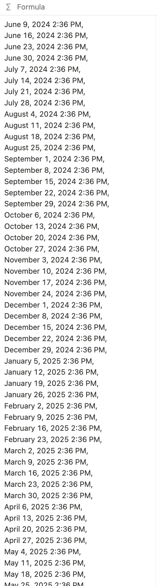

这篇笔记是为了理清一下用 notion formula 来构建类 GitHub 热力图的思路。

## 前序工作

在正式开始编写公式之前，需要做好数据库的搭建和关联准备。以创建阅读记录为范例，我们需要首先搭建两个数据库：

- 阅读记录数据库(Habit record)
- 记录跟踪数据库(the habit tracker)

在 Habit record 数据库中创建 `Name`、`Date`、`the habit tracker`(是一个 relation 属性关联另外一个数据库)。

在 the habit tracker 数据库中，包含三个属性 `Name`、`Formula`（编写热力图）、`Records`（关联属性）。

准备好两个数据库和测试数据之后，就可以开始编写公式了。

## 公式基本思路

## 具体步骤

### 1. 确定关键时间节点：今天是本周的第几天、本周天的日期以及 52 周前的周天的日期

#### 1.1 确定今天是本周的第几天

```js
lets(today, day(now()));
```

#### 1.2 确定本周天的日期

```js
lets(
  today, day(now()),
  startOfThisWeek, if(today == 7, now(), dateSubtract(now(), today, "days")),
)
```

#### 1.3 确定 52 周前的周天的日期

```js
lets(
  today, day(now()),
  startOfThisWeek, if(today == 7, now(), dateSubtract(now(), today, "days")),
  firstSunDate, dateSubtract(startOfThisWeek, 52, "weeks"),
)
```

### 2. 绘制热力图方块，先绘制第一行，也就是 52 周的每一个周天，再扩充每周的七天，通过判断该日期当天是否有读书记录，来确定方块是实心还是空心的

#### 2.1 绘制热力图第一行

```js
lets(
  today, day(now()),
  startOfThisWeek, if(today == 7, now(), dateSubtract(now(), today, "days")),
  firstSunDate, dateSubtract(startOfThisWeek, 52, "weeks"),
  firstRow, repeat("S",52).split("").map(dateAdd(firstSunDate, index, "weeks"）),
)
```

注： 这里的 `repeat("s",52)`是起到一个占位的作用，之后用具体的星期天的日期来替换, 这样写得出来的效果就是：


#### 2.2 然后我们来补全 52 周的所有日期

```js
lets(
  dateFormat,"MMM D, Y",
  today, day(now()),
  startOfThisWeek, if(today == 7, now(), dateSubtract(now(), today, "days")),
  firstSunDate, dateSubtract(startOfThisWeek, 52, "weeks"),
  firstRow, repeat("S",52).split("").map(dateAdd(firstSunDate, index, "weeks")),
  grid, [0,1,2,3,4,5,6].map(repeat(current,52).split("").map(dateAdd(firstSunDate, index * 7 + toNumber(current),"days")).map(formatDate(current, dateFormat)).join("")).join("\n"),
)
```

注： 这里我们先通过数组`[0,1,2,3,4,5,6]`来标记出一共有七行，然后每一行先展开 52 个空位，用 0-6 填满，然后引入我们之前计算出来的每一个星期天，来扩充 52 周每一天的日期，最后统一一下格式：


然后我们应对一下特殊情况，如果今天的日期所属的天数大于等于我们遍历到的天数，我们其实需要在这一行显示 53 个格子，如果小于的话也就是还没有到，就只用显示 52 个格子，所以我们可以把上面的公式修改为：

```js
lets(
  dateFormat,"MMM D, Y",
  today, day(now()),
  startOfThisWeek, if(today == 7, now(), dateSubtract(now(), today, "days")),
  firstSunDate, dateSubtract(startOfThisWeek, 52, "weeks"),
  firstRow, repeat("S",52).split("").map(dateAdd(firstSunDate, index, "weeks")),
  grid, [0,1,2,3,4,5,6].map(repeat(current,if(today >= current && today !=7, 53, 52)).split("").map(dateAdd(firstSunDate, index * 7 + toNumber(current),"days")).map(formatDate(current, dateFormat)).join("")).join("\n"),
)
```

#### 2.3 遍历比较读书记录和日期，根据比较结果来调整显示：

```js
lets(
  dateFormat,"MMM D, Y",
  readingRecords,props("records").map(formatDate(current.prop("Date"), dateFormat)),
  today, day(now()),
  startOfThisWeek, if(today == 7, now(), dateSubtract(now(), today, "days")),
  firstSunDate, dateSubtract(startOfThisWeek, 52, "weeks"),
  firstRow, repeat("S",52).split("").map(dateAdd(firstSunDate, index, "weeks")),
  grid, [0,1,2,3,4,5,6].map(repeat(current,if(today >= current && today !=7, 53, 52)).split("").map(dateAdd(firstSunDate, index * 7 + toNumber(current),"days")).map(formatDate(current, dateFormat)).map(if(includes(readingRecords, current),"■","□")).join("")).join("\n"),
)
```

这样绘制出来的效果如图：


### 3 给热力图加上星期和月份标签

#### 3.1 给热力图添加星期标签

```js
 weekLabels, ["Sun", "Mon", "Tue", "Wed", "Thu", "Fri", "Sat"].map(current.style("gray_background","gray","c")),
```

注：星期标签可以通过数组来时间，为了显示更友好，所以稍微修饰了一下样式；然后我们把标签加到遍历中去：

```js
lets(
  dateFormat,"MMM D, Y",
  readingRecords,props("records").map(formatDate(current.prop("Date"), dateFormat)),
  weekLabels, ["Sun", "Mon", "Tue", "Wed", "Thu", "Fri", "Sat"].map(current.style("gray_background","gray","c")),
  today, day(now()),
  startOfThisWeek, if(today == 7, now(), dateSubtract(now(), today, "days")),
  firstSunDate, dateSubtract(startOfThisWeek, 52, "weeks"),
  firstRow, repeat("S",52).split("").map(dateAdd(firstSunDate, index, "weeks")),
  grid, [0,1,2,3,4,5,6].map(repeat(current,if(today >= current && today !=7, 53, 52)).split("").map(dateAdd(firstSunDate, index * 7 + toNumber(current),"days")).map(formatDate(current, dateFormat)).map(if(includes(readingRecords, current),"■","□")).join("")).map(weekLabels.at(index) + current).join("\n"),
)
```

最终效果如图：


#### 3.2 给热力图加上月份标签

```js
 monthLabel, repeat(" ", 52 + 1).split("")
        .map(dateAdd(firstSunDate, index, "weeks"))
        .map(ifs(date(current) <= 4, formatDate(current, "MMMM").split("").at(0),
            date(dateAdd(current, 3, "days")) <= 4, formatDate(dateAdd(current, 3, "days"), "MMMM").split("").at(0),
            "◌"))
        .map(current.style("white_background", "gray", "c", "b"))
        .join(" "),
```

除了月份标签以外，我们还需要占位符：

```js
 placeHolder, ["M", "M"].map(" ".style("gray_background", "gray", "c", "b")).join(""),
```
